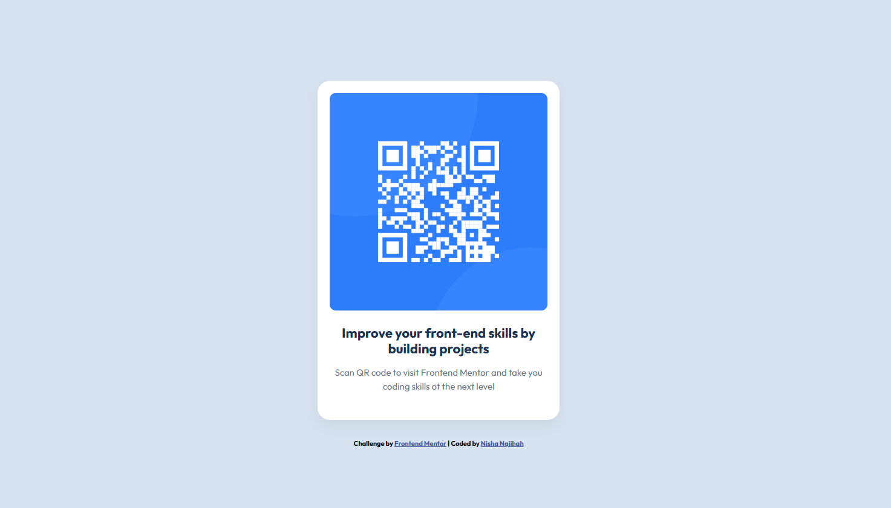

# Frontend Mentor - QR code component solution 2025

This is a solution to the [QR code component challenge on Frontend Mentor](https://www.frontendmentor.io/challenges/qr-code-component-iux_sIO_H). Frontend Mentor challenges help you improve your coding skills by building realistic projects. 

## Table of contents

- [Frontend Mentor - QR code component solution 2025](#frontend-mentor---qr-code-component-solution-2025)
  - [Table of contents](#table-of-contents)
  - [Overview](#overview)
    - [Screenshot](#screenshot)
    - [Links](#links)
  - [My process](#my-process)
    - [Built with](#built-with)
    - [What I learned](#what-i-learned)
    - [Continued development](#continued-development)
    - [Useful resources](#useful-resources)
  - [Author](#author)

## Overview

### Screenshot



### Links

- Solution URL: [Add solution URL here](https://your-solution-url.com)
<!-- - Live Site URL: [Add live site URL here](https://your-live-site-url.com) -->

## My process

I created a simple QR code component following the design specifications. This component features a QR code image that links to Frontend Mentor, along with descriptive text. The layout is responsive and centered on the page with a clean design.

### Built with

- Semantic HTML5 markup
- CSS custom properties (variables)
- Flexbox
- CSS Grid
- Mobile-first workflow
- Google Fonts (Outfit)

### What I learned

During this project, I learned several important concepts:

- Structing my HTML for accessibility and clarity

```html
<div class="container">
      
      <h1>Improve your front-end skills by building projects</h1>
      <p>Scan QR code to visit Frontend Mentor and take your coding skills to the next level</p>
</div>
```

- Using CSS Variables for consistent colors

```css
:root {
      --white: hsl(0, 0%, 100%);      /* White background for card */
      --slate-300: hsl(212, 45%, 89%); /* Light blue for page background */
      --slate-500: hsl(216, 15%, 48%); /* Medium slate for paragraph text */
      --slate-900: hsl(218, 44%, 22%); /* Dark slate for headings */
}
```

- Centering content with Flexbox

```css
body {
      display: flex;
      flex-direction: column;
      align-items: center;
      justify-content: center;
      min-height: 100vh;
}
```

- Creating a responsive design with media queries:

```css
@media screen and (min-width: 375px) {
      .container {
            width: 340px;
      }
}
```

### Continued development

in future projects, i want to focus on:

- improving my understanding of responsive design principles
- Learning more about accessibility best practices
- Exploring CSS Grid for more complex layouts
- Practicing with more advanced CSS techniques like animations and transitions

### Useful resources

- [MDN Web Docs](https://developer.mozilla.org/en-US/docs/Web/CSS) - This was invaluable for understanding CSS properties and how to use them effectively.
- [CSS-Tricks Flexbopx Guide](https://css-tricks.com/snippets/css/a-guide-to-flexbox/) - This helped me understand how to use flexbox for centering elements

- [Google Fonts](https://fonts.google.com/) - A great resource for finding and implementing web fonts.

## Author

- Website - [Nisha Najihah](https://www.your-site.com)
- Frontend Mentor - [@nishanajihah](https://www.frontendmentor.io/profile/nishanajihah)
- Linktree - [@nisha.najihah](https://linktr.ee/nisha.najihah)